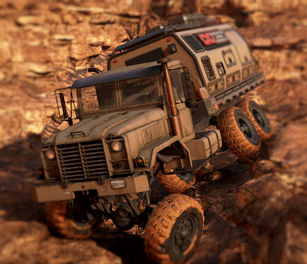

> #### Expeditions: A MudRunner Game

___

# MK38 XT

 
## Description

This mod is a bit OP as it was made for my personal use. If you're looking for a go-anywhere MK38 rock crawler then you may like it. No vanilla options here. Internal sideboard allows the full use of the flatbed for other uses.

Bobblehead and air freshener sockets have been added to use GGMS addons (metal detector, seismometer, etc.).

### Drivetrain

- 3 powerful engines to choose from
- 3 transmissions for different driving styles
- 3 suspension systems from mild to wild
- 4 super-single tire options in both enhanced and extreme versions

### Assorted Tweaks

- 4 high-powered advanced winches
- Increased fuel tank capacity
- Reduced steering speed
- Increased steering angle for tighter turns
- Combination of engine/truck sounds from different stock vehicles
- Increased damage capacity of all parts
- No visual damage for truck
- Increased mass with lowered center of gravity for better performance
- Lowered prices for most things
- All parts are unlocked
- 8 slot inventory
- 8 slot internal sideboard (invisible)
- All bumpers, fenders, etc. have the same crash protection and mass so are just for cosmetic use
- Enhanced vehicle reserve packages
- Reduced damage option

See pics and subscribe at the [mod.io](https://mod.io/g/expeditions/m/mk38-xt) website!